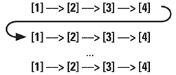
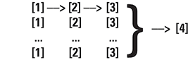

# Functional PSHA

## Abstract

Probabilistic seismic hazard analysis (PSHA; Cornell, 1968) is elegant in its relative simplicity.
However, in the more than 40-years since its publication, the methodology has come to be applied
to increasingly complex and non-standard source and ground motion models. For example, the third
Uniform California Earthquake Rupture Forecast ([UCERF3](http://pubs.usgs.gov/of/2013/1165/))
upended the notion of discrete faults as independent sources, and the USGS national seismic hazard
model uses temporally clustered sources. Moreover, as the logic trees typically employed in PSHAs
to capture epistemic uncertainty grow larger, so too does the demand for a more complete
understanding of uncertainty. At the USGS, there are additional requirements to support source
model mining, disaggregation, and map-making, often through the use of dynamic web-applications.
Implementations of the PSHA methodology commonly iterate over all sources that influence the
hazard at a site and sequentially build a single hazard curve. Such a linear PSHA computational
pipeline, however, proves difficult to maintain and modify to support the additional complexity of
new models, hazard products, and analyses. The functional programming paradigm offers some relief.
The functional approach breaks calculations down into their component parts or steps, storing
intermediate results as immutable objects, making it easier to: chain actions together; preserve
intermediate data or results that may still be relevant (e.g. as in a disaggregation); and leverage
the concurrency supported by many modern programming languages.

## Traditional PSHA formulation (after Baker, 2013)

")
Briefly, the rate, *λ*, of exceeding an intensity measure, *IM*, level may be computed as a
summation of the rate of exceeding such a level for all relevant earthquake sources (discretized
in magnitude, *M*, and distance, *R*). This formulation relies on models of ground motion that
give the probability that an intensity measure level of interest will be exceeded conditioned on
the occurrence of a particular earthquake. Such models are commonly referred to as:

* __Intensity measure relationships__
* __Attenuation relationships__
* __Ground motion prediction equations (GMPEs)__
* __Ground motion models (GMMs)__

The parameterization of modern models (e.g. NGA-West2; Bozorgnia et al., 2014) extends to much
more than magnitude and distance, including, but not limited to:

* __Multiple distance metrics__ (e.g. rJB, rRup, rX, rY)
* __Fault geometry__ (e.g. dip, width, rupture depth, hypocentral depth)
* __Site characteristics__ (e.g. basin depth terms, site type or Vs30 value)

## Simple, yes, but used for so much more…

While this formulation is relatively straightforward and is typically presented with examples for
a single site, using a single GMM, and a nominal number of sources, modern PSHAs commonly include:

* Multiple thousands of sources (e.g. the 2014 USGS NSHM in the Central & Eastern US includes all
  smoothed seismicity sources out to 1000km from a site).
* Different source types, the relative contributions of which are important, and the GMM
  parameterizations of which may be different.
* Sources (and associated ruptures – source filling or floating) represented by logic trees of
  magnitude-frequency distributions (MFDs).
* Source MFDs subject to logic trees of uncertainty on Mmax, total rate (for the individual source,
  or over a region, e.g. as in UCERF3) or other properties of the distribution.
* Logic trees of magnitude scaling relations for each source.
* Source models that do not adhere to the traditional formulation (e.g. cluster models of the NSHM).
* Logic trees of ground motion models.

## And further extended to support…

* Response Spectra, Conditional Mean Spectra – multiple intensity measure types (IMTs; e.g. PGA,
  PGD, PGV, multiple SAs)
* Disaggregation
* Banded disaggregation (multiple disaggregations at varying IMLs)
* Maps – many thousands of sites
* Uncertainty analyses

## How are such calculations managed?

* PSHA codes typically compute hazard in a linear fashion, looping over all relevant sources for
  a site.
* Adding additional GMMs, logic trees, IMT’s, and sites is addressed with more, outer loops:

```PHP
foreach IMT {
    foreach Site {
        foreach SourceType {
            foreach GMM {
                foreach Source {
                    // do something
                }
            }
        }   
    }
}
```

* Support for secondary analyses, such as disaggregation is supplied by a separate code or codes
  and can require repeating many of the steps performed to generate an initial hazard curve.

## What about scaleability, maintenance, and performance?

* Although scaleability can be addressed for secondary products, such as maps, by distributing
  individual site calculations over multiple processors and threads, it is often difficult to
  leverage multi-core systems for individual site calculations. This hampers one’s ability to
  leverage multi-core systems in the face of ever more complex source and ground motion models and
  their respective logic trees.
* A linear pipeline complicates testing, requiring end to end tests rather than tests of discrete
  calculations.
* Multiple codes repeating identical tasks invite error and complicate maintenance by multiple
  individuals.

## Enter functional programming…

* <http://en.wikipedia.org/wiki/Functional_programming>
* Functional programming languages have been around for some time (e.g. Haskell, Lisp, R), and
  fundamental aspects of functional programming/design are common in many languages. For example,
  a cornerstone of the functional paradigm is the anonymous (or lambda) function; in Matlab, one
  may write [sqr = @(x) x.^2;].
* In Matlab, one may pass function ‘handles’ (references) to other functions as arguments. This
  is also possible in Javascript, where such handles serve as callbacks. Given the rise in
  popularity of the functional style, Java 8 added constructs in the form of the function
  and streaming APIs, and libraries exists for other languages.

## How do PSHA and related calculations leverage such an approach?

Break the traditional PSHA formulation down into discrete steps and preserve the data associated
with each step:

* __[1]__ Source & Site parameterization
* __[2]__ Ground motion calculation (mean and standard deviation only)
* __[3]__ Exceedance curve calculation (per source)
* __[4]__ Recombine

Whereas the traditional pipeline looks something like this:



The functional pipeline can be processed stepwise:



__Need a disaggregation?__ Revisit and parse the results of steps 1 and 2

__Need a response spectra?__ Spawn more calculations, one for each IMT, at step 2.

## Benefits

* It’s possible to build a single calculation pipeline that will handle a standard hazard curve
  calculation and all of its extensions without repetition.
* Pipeline performance scales with available hardware.
* No redundant code.
* Can add or remove transforms or data at any point in the pipeline, or build new pipelines
  without adversely affecting existing code.

## Drawbacks

* Greater memory requirements.
* Additional (processor) work to manage the flow of calculation steps.

## References

* Baker J.W. (2013). An Introduction to Probabilistic Seismic Hazard Analysis (PSHA), White Paper,
  Version 2.0, 79 pp.
* Bozorgnia, Y., et al. (2014) NGA-West2 Research Project, *Earthquake Spectra*, Vol. 30, No. 3,
  pp. 973-987.
* Cornell, C.A., 1968, Engineering seismic risk analysis, *Bulletin of the Seismological Society
  of America*, Vol. 58, No. 5, pp. 1583-1606.

---

[__Documentation Index__](../README.md)

---
 &nbsp;[U.S. Geological Survey](https://www.usgs.gov)
National Seismic Hazard Mapping Project ([NSHMP](https://earthquake.usgs.gov/hazards/))
