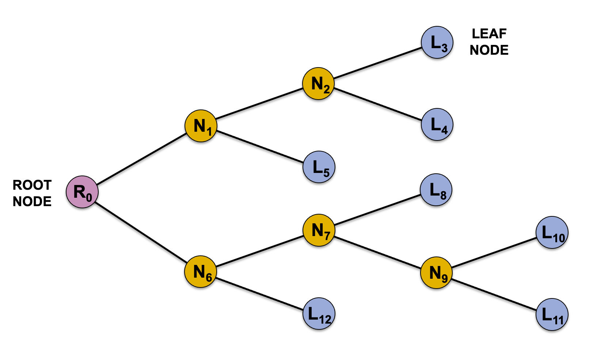
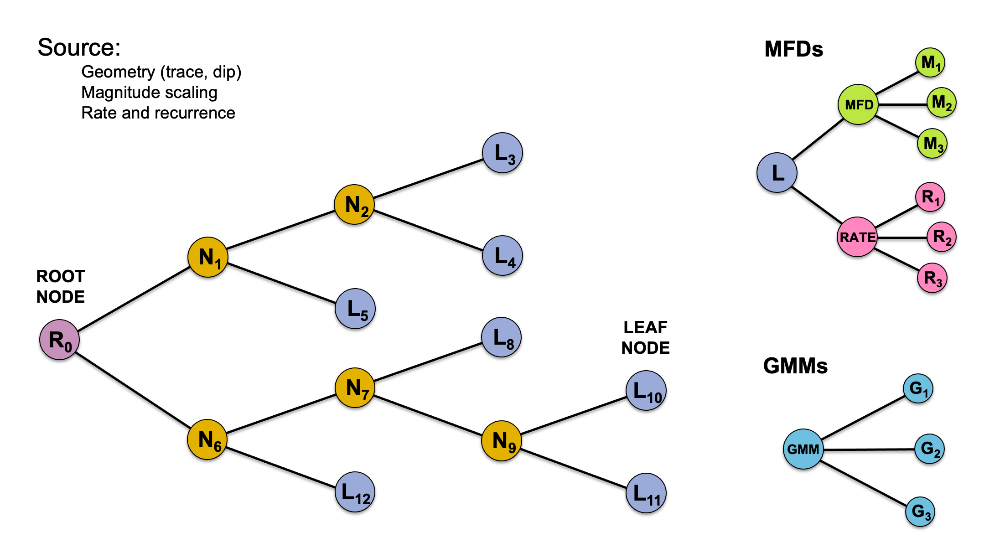
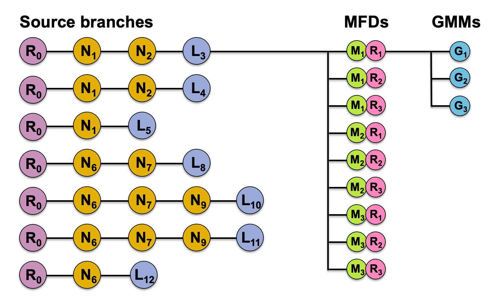

# Implementation Details

## Logic Trees

The logic trees of epistemic uncertainty described in previous section are represented internally
using graphs of indexed nodes that connect a `root` node with one or more `leaf` nodes:

The different logic trees for sources, MFDs and GMMs have similar representations:

And each unique branch combination across all trees is considered in the hazard integral:

---

[**Documentation Index**](../README.md)

---
 &nbsp;[U.S. Geological Survey](https://www.usgs.gov)
National Seismic Hazard Mapping Project ([NSHMP](https://earthquake.usgs.gov/hazards/))
